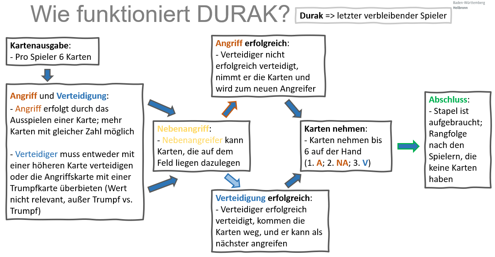

# Durak - Ein ausführliches ReadMe

## 1. Einführung: Was ist Durak?
Durak ist ein traditionelles russisches Kartenspiel, das in vielen Ländern bekannt und beliebt ist. Der Name "Durak" bedeutet auf Russisch so viel wie "Dummkopf" oder "Narr", was auf die Spieler anspielt, die das Ziel haben, nicht als Letzter Karten auf der Hand zu behalten.

## 2. Ziel des Spiels:
Das Hauptziel von Durak ist es, alle Karten loszuwerden und nicht als letzter Spieler Karten auf der Hand zu haben. Der Spieler, der am Ende übrig bleibt und noch Karten hat, wird als der "Durak" bezeichnet.

## 3. Spielablauf:
- **Spieler:** Durak wird mit 2 bis 6 Spielern gespielt, wobei 36 Karten verwendet werden. Im Spiel werden die Karten in der Regel in aufsteigender Reihenfolge von der 6 bis zum Ass verwendet.

- **Verteilung der Karten:**
  - Jeder Spieler erhält zunächst sechs Karten, und eine offene Karte wird in die Mitte des Tisches gelegt.

- **Angriff und Verteidigung:**
  - Ein Spieler ist der "Angreifer", der andere der "Verteidiger". Der Angreifer versucht, Karten auf die Hand des Verteidigers zu legen, während der Verteidiger versucht, dies zu verhindern.
  - Der Angriff erfolgt mit einer Karte aus der Hand des Angreifers, und der Verteidiger versucht, diese Karte mit einer höheren Karte zu schlagen.

- **Regeln für das Schlagen:**
  - Der Verteidiger kann die angreifende Karte mit einer Karte derselben Farbe und höherem Wert schlagen oder mit einer Trumpfkarte (falls vorhanden).
  - Wenn der Verteidiger die Karte nicht schlagen kann, nimmt er die Karten auf die Hand.

- **Trumpffarbe:**
  - Eine der Farben wird als Trumpffarbe bestimmt. Karten dieser Farbe haben Vorrang vor Karten anderer Farben.

- **Ende des Angriffs:**
  - Der Angriff endet, wenn der Verteidiger die Karten schlägt oder aufnimmt. Der nächste Spieler in der Reihe wird der neue Angreifer.

- **Sonderregel:**
  - Es ist erlaubt, Karten in einer bestimmten Runde auszusetzen (nicht zu verteidigen), um den Druck auf den Verteidiger zu erhöhen.

- **Spielende:**
  - Das Spiel endet, wenn der Stapel aufgebraucht ist und ein Spieler alle seine Karten losgeworden ist. Der letzte Spieler mit Karten in der Hand wird zum Durak erklärt.

## 4. Fazit:
Durak ist ein fesselndes Kartenspiel, das Strategie, Taktik und manchmal auch Glück erfordert. Die Kombination aus Angriff und Verteidigung macht es zu einem aufregenden Spiel für Spieler aller Altersgruppen. Viel Spaß beim Spielen von Durak!
